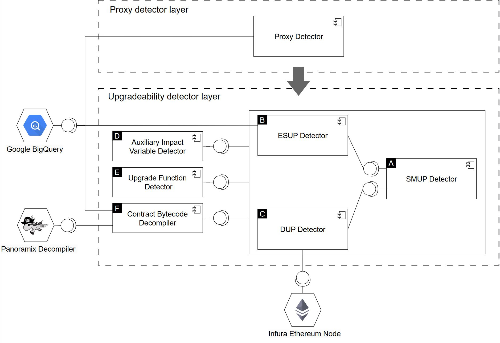

# UPC Sentinel
UPC Sentinel detects upgradeability proxy contracts (UPCs) through a two-layered approach. The input of UPC sentinel is a list of smart contract addresses. The architecture of UPC Sentinel consists of two distinct layers: i) the proxy contract detector and ii) the upgradeability detector. The proxy contract detector ascertains if a given contract operates as a proxy. In contrast, the upgradeability detector examines whether an identified proxy contract is specifically tailored for upgradeability purposes. For every input contract, the output of UPC Sentinel is a binary label that determines whether the given contract is an upgradeability proxy contract (UPC) or Non-UPC.



# Getting Started with Google BigQuery for Free

Google BigQuery is a powerful, scalable, and cost-effective multi-cloud data warehouse designed for business agility. This README provides step-by-step instructions to set up a free Google BigQuery account.

## Step 1: Create a Google Account

If you do not already have a Google account, you will need to create one:

1. Go to [Google Accounts](https://accounts.google.com/signup).
2. Follow the prompts to create your new Google account.

## Step 2: Sign Up for Google Cloud Platform

1. Visit the [Google Cloud Platform Console](https://console.cloud.google.com/).
2. Sign in with your Google account if you are not already logged in.
3. If this is your first time accessing Google Cloud Platform, you will need to agree to the terms of service and set up your Cloud account with your billing information.

## Step 3: Activate the Google Cloud Free Tier

Google Cloud offers a Free Tier which includes $300 in free credits to spend on Google Cloud services over the next 12 months and provides limited access to many common Google Cloud resources, including BigQuery.

1. Navigate to the [Google Cloud Free Tier page](https://cloud.google.com/free).
2. Click on the **Get started for free** button.
3. Enter your country, agree to the terms of service, and click **Continue**.
4. Complete the billing information (credit card and billing address). Your credit card will not be charged unless you upgrade to a paid account.
5. Once completed, you will have access to the $300 free credit.


# Setting Up Google BigQuery Client

This guide will walk you through setting up the Google Cloud BigQuery Client in your local development environment.

## Step 1: Set Up Your Environment

Ensure that Python (3.8.9) is installed on your machine. You will also need to install the Google Cloud BigQuery Client library and others. If it's not already installed, you can do so using `pip`. Open your terminal and run the following command:

```bash
pip install --upgrade google-cloud-bigquery
pip install overrides
pip install tqdm
pip install google-cloud-storage
```

## Step 2: Set Up Google Cloud Authentication

To interact with Google BigQuery, you need to authenticate your client application with Google Cloud. Follow these steps to set up authentication:

### Create a Google Cloud Project

- If you haven't already, create a project in the Google Cloud Console at [Google Cloud Console](https://console.cloud.google.com/).

### Enable the BigQuery API

- Ensure your project is selected in the Google Cloud Console.
- Navigate to the **APIs & Services** dashboard.
- Click on **+ ENABLE APIS AND SERVICES**.
- Search for **BigQuery API** and enable it for your project.

### Create a Service Account Key

1. **Navigate to Service Accounts**:
   - In the Google Cloud Console, go to **IAM & Admin > Service Accounts**.

2. **Create Service Account**:
   - Click **Create Service Account**.
   - Enter a name for the service account and click **Create**.

3. **Assign Role**:
   - Assign the **BigQuery Admin** and **Storage Admin** role (or a more restrictive role if necessary) from the role list and click **Continue**.

4. **Finish Creating Service Account**:
   - Click **Done** to complete the service account creation.

5. **Manage Service Account Keys**:
   - Click on the newly created service account for more options.
   - Go to the **Keys** tab.
   - Click **Add Key**, then select **Create New Key**.

6. **Download Key**:
   - Choose **JSON** as the key type and click **Create**. This will download the JSON key file to your machine.

# Running UPC Sentinel
1. **Install Panoramix**
2. **Place the Json key file in src/ directory**
3. **Configure Util.py with the Json key file name and other configurations**
```bash
DATA_DIR = os.path.abspath("../storage/") # path where files are downloaded
DECOMPILER_OUTPUT_DIR = os.path.join(DATA_DIR, 'decompiled-bytecodes') # path where panoramix writes its output decompiled bytecodes
DECOMPILER_TIMEOUT = 3600 # panormaix decompiler timeout
STUDY_START_DATE = "2015-01-01"
STUDY_END_DATE = "2022-09-01"
BQ_KEY_PATH = 'lateral-command-433401-d4-89aa899f9420.json' # Json key file name
BQ_PROJECT_ID = '-'.join(BQ_KEY_PATH.split("-")[:len(BQ_KEY_PATH.split("-")) -1])
BQ_STORAGE_PROXY_DETECTOR = 'storage_dynamic_proxy_detector'
BQ_STORAGE_BYTECODES = 'storage_bytecodes'
CORE_COUNT = int(multiprocessing.cpu_count() * 0.75) # 80 * .75 = 60 # number of cores for reading files and performing parallel decompilation.
```
4. **Prepare your list of input contract addresses**
   - This is a list of Ethereum Contract Accounts (CAs) stating with "0x" and in lower case format.
5. **Run Main.py with your list of input contract addresses**
   - Initialize Proxy Detector. To initialize the Proxy Detector for the first time, set the `init` parameter to `True`. This will trigger the identification and download of active proxy contracts. Once the initial download is complete, change the init parameter to False for subsequent runs. This prevents re-downloading the proxy contracts and instead reads the already stored objects from disk.
   - Initialize Bytecode Decompiler. To initialize the Bytecode Decompiler for the first time, set the `init` parameter to `True`. This will trigger the identification and download of bytecode objects. Once the initial download is complete, change the init parameter to False for subsequent runs. This prevents re-downloading bytecodes and instead reads the already stored objects from disk.
   - Read your input list of contract addresses (e.g., ['0xd54f502e184b6b739d7d27a6410a67dc462d69c8'])
   - Call the is_upc_batch(input_contract_addresses, beacon_dataset_name, early_stop = False) function
      - The early_stop=True will stop looking deeper into the contract as soon as it is detected as UPC.
      - Pick your beacon_dataset_name (i.e., the dataset of target depencdies that ESUP detector fetches). To avoid overriding the target depencies for each experiment (i.e., a set of input contracts), we recommend you pick a different name for each. For instances, 'df-beacons-uschunt' or 'df-beacons-etherscan'. Also, only use alphebtic characters along with hyphen as these are accepted naming convetions for Google BigQuery storage names.

## Citations

This project uses data and methodologies based on several foundational texts and papers. If you use this software, adapt its code, or incorporate its methodologies in academic or professional contexts, please consider citing the following:

```
@article{Ebrahimi23,
author = {Ebrahimi, Amir and Adams, Bram and Oliva, Gustavo and Hassan, Ahmed E.},
year = {2023},
month = {05},
pages = {},
title = {A Large-Scale Exploratory Study on the Proxy Pattern in Ethereum}
}

@unknown{Ebrahimi24,
author = {Ebrahimi, Amir and Adams, Bram and Oliva, Gustavo and Hassan, Ahmed E.},
year = {2023},
month = {12},
pages = {},
title = {UPC Sentinel: An Accurate Approach for Detecting Upgradeability Proxy Contracts in Ethereum},
}

```
